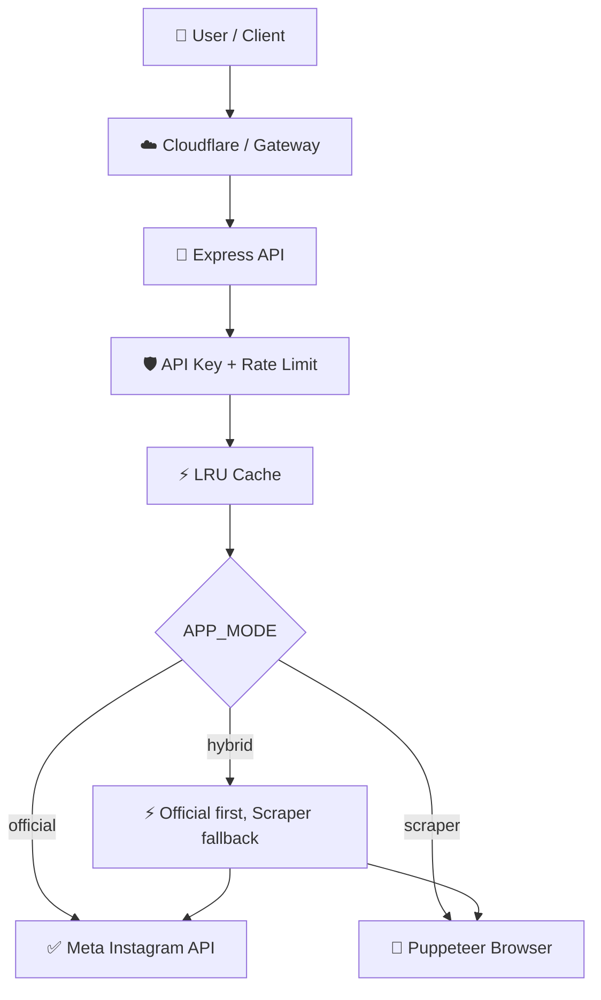

# 🚀 TenRusl Instagram API Node.js v2


**TenRusl Instagram API v2** adalah API Instagram production-ready dengan tiga mode utama:

| Mode | Ikon | Fungsi | Target terbaik |
|---|---:|---|---|
| **Official** | ✅ | Ambil media lewat Meta Instagram API resmi | Vercel, Netlify, Cloudflare, VPS |
| **Local** | 🧑‍💻 | Development lokal dengan Node.js/Puppeteer | Windows/Linux/macOS |
| **Scraper Production** | 🐳 | Public scraper best-effort via Puppeteer Docker | VPS, Docker, container platform |
| **Hybrid** | ⚡ | Official dulu, fallback ke scraper | Production advanced |

> ⚠️ Catatan penting: jalur **resmi** untuk production jangka panjang adalah Meta Instagram API. Jalur **scraper** disediakan untuk local, internal tooling, fallback, atau non-resmi production yang dikontrol sendiri.

---

## ✨ Fitur Ultimate

- ✅ **3 mode runtime**: `official`, `scraper`, `hybrid`
- 🛡️ **Security middleware**: Helmet, CORS whitelist, API key optional
- 🚦 **Rate limit** untuk public API
- ⚡ **LRU cache** agar tidak scraping setiap request
- 🧠 **Queue/concurrency control** untuk Puppeteer
- 🐳 **Docker production** berbasis Puppeteer image
- ☁️ **Adapter Vercel, Netlify, Cloudflare Worker**
- 🧪 **Unit test** dengan `node:test`
- 🔍 **Health check** dan readiness endpoint
- 🧾 **Logging production** dengan Pino
- 🔁 **Backward compatibility** endpoint lama `/api/instagram/:username`
- 📚 **Dokumentasi lengkap** untuk API, deploy, security, dan troubleshooting

---

## 🧭 Mode yang harus dipilih

### ✅ 1. Production Resmi

Gunakan jika ingin aman, stabil, dan profesional.

```env
APP_MODE=official
META_API_ENABLED=true
META_ACCESS_TOKEN=...
META_IG_USER_ID=...
META_USERNAME=kakrusliandika
SCRAPER_ENABLED=false
```

Cocok untuk:

- Vercel
- Netlify
- Cloudflare Worker/Pages
- VPS
- Render/Fly.io/Railway

### 🧑‍💻 2. Local Development

Gunakan untuk coding/testing lokal.

```env
APP_MODE=scraper
NODE_ENV=development
API_KEY_ENABLED=false
CACHE_TTL_SECONDS=60
MAX_CONCURRENT_SCRAPES=1
```

### 🐳 3. Non-Resmi Production Scraper

Gunakan jika ingin menjalankan Puppeteer secara production di server sendiri.

```env
APP_MODE=scraper
NODE_ENV=production
API_KEY_ENABLED=true
API_KEY=long-random-secret
CACHE_TTL_SECONDS=900
MAX_CONCURRENT_SCRAPES=2
```

Target terbaik:

- VPS Ubuntu + Docker
- Cloudflare CDN di depan VPS
- Render/Fly.io/Railway dengan Docker

---

## 🏗️ Arsitektur



---

## 📁 Struktur Project

```txt
.
├─ src/
│  ├─ app.js
│  ├─ server.js
│  ├─ config/
│  ├─ controllers/
│  ├─ middlewares/
│  ├─ routes/
│  ├─ services/
│  ├─ serverless/
│  ├─ tests/
│  ├─ utils/
│  └─ validators/
├─ cloudflare/worker/
├─ netlify/functions/
├─ docker/
├─ deploy/nginx/
├─ deploy/systemd/
├─ docs/
├─ public/
├─ .github/workflows/
├─ docker-compose.yml
├─ vercel.json
├─ netlify.toml
├─ package.json
└─ README.md
```

---

## 🚀 Instalasi Local

### 1. Install dependency

```bash
npm install
```

### 2. Buat `.env`

```bash
cp .env.local.example .env
```

### 3. Jalankan development server

```bash
npm run dev
```

### 4. Cek API

```bash
curl http://localhost:3000/health
curl "http://localhost:3000/api/v1/instagram/kakrusliandika?limit=12"
```

---

## 📡 Endpoint API

### Health

```http
GET /health
GET /health/ready
```

### Instagram v1

```http
GET /api/v1/instagram/:username
GET /api/v1/instagram/:username?limit=12
GET /api/v1/instagram/:username?source=official
GET /api/v1/instagram/:username?source=scraper
GET /api/v1/instagram/:username?refresh=true
```

### Legacy endpoint

```http
GET /api/instagram/:username
GET /api/instagram?username=kakrusliandika
```

---

## 📦 Contoh Response

```json
{
  "success": true,
  "mode": "hybrid",
  "source": "official",
  "username": "kakrusliandika",
  "count": 12,
  "cached": false,
  "data": [
    {
      "id": "123",
      "imageUrl": "https://...",
      "caption": "Caption Instagram",
      "postUrl": "https://www.instagram.com/p/...",
      "mediaType": "IMAGE",
      "source": "official"
    }
  ],
  "generatedAt": "2026-06-21T00:00:00.000Z"
}
```

---

## 🛡️ API Key Production

Aktifkan di `.env`:

```env
API_KEY_ENABLED=true
API_KEY=isi_dengan_secret_panjang
```

Request:

```bash
curl "https://api.example.com/api/v1/instagram/kakrusliandika" \
  -H "X-API-Key: isi_dengan_secret_panjang"
```

---

## 🐳 Docker VPS Production

### 1. Copy env production

```bash
cp .env.production.example .env
nano .env
```

### 2. Build dan run

```bash
docker compose up -d --build
```

### 3. Cek log

```bash
docker compose logs -f
```

### 4. Cek health

```bash
curl http://127.0.0.1:3000/health
```

---

## ☁️ Deployment Map

| Platform | Rekomendasi | Mode |
|---|---|---|
| 🐳 VPS Ubuntu + Docker | Paling cocok untuk scraper production | `scraper` / `hybrid` |
| ☁️ Cloudflare DNS/CDN | Gateway, SSL, protection | Semua mode |
| ⚡ Cloudflare Worker | Official API / gateway ke VPS | `official` / `hybrid proxy` |
| ▲ Vercel | Official API ringan, bukan Puppeteer berat | `official` |
| ◆ Netlify | Official function ringan | `official` |
| 🧪 GitHub Actions | CI/CD, test, Docker image | Semua mode |
| 📦 GHCR | Simpan Docker image | `scraper` / `hybrid` |

---

## ▲ Vercel Official Mode

Set environment di Vercel:

```env
APP_MODE=official
SCRAPER_ENABLED=false
META_API_ENABLED=true
META_ACCESS_TOKEN=...
META_IG_USER_ID=...
META_USERNAME=kakrusliandika
```

Disarankan install tanpa optional dependency:

```bash
npm install --omit=optional
```

---

## ◆ Netlify Official Mode

Netlify function tersedia di:

```txt
netlify/functions/instagram.js
```

Endpoint setelah deploy:

```txt
/api/v1/instagram/kakrusliandika
```

---

## ☁️ Cloudflare Worker Gateway

Folder:

```txt
cloudflare/worker/
```

Deploy:

```bash
cd cloudflare/worker
cp wrangler.toml.example wrangler.toml
wrangler secret put META_ACCESS_TOKEN
wrangler secret put META_IG_USER_ID
wrangler deploy
```

Untuk hybrid gateway ke VPS scraper:

```toml
[vars]
APP_MODE = "hybrid"
SCRAPER_API_URL = "https://api.example.com"
```

---

## 🔧 Script NPM

| Script | Fungsi |
|---|---|
| `npm run dev` | Jalankan server development dengan watch mode |
| `npm start` | Jalankan server biasa |
| `npm run check` | Cek syntax semua file JS |
| `npm test` | Jalankan unit test |
| `npm run doctor` | Cek konfigurasi dasar |
| `npm run docker:build` | Build image Docker |
| `npm run docker:run` | Run image Docker dengan `.env` |

---

## 🧪 Testing

```bash
npm run check
npm test
npm run doctor
```

---

## 🔐 Security Checklist

- [ ] `API_KEY_ENABLED=true` untuk public production scraper
- [ ] `CORS_ORIGIN` tidak memakai `*` di production sensitif
- [ ] `RATE_LIMIT_MAX` disesuaikan
- [ ] `CACHE_ENABLED=true`
- [ ] `MAX_CONCURRENT_SCRAPES` kecil, mulai dari `2`
- [ ] Token Meta tidak pernah ditaruh di frontend
- [ ] VPS dilindungi Cloudflare
- [ ] SSL aktif
- [ ] Log tidak membocorkan secret

---

## 🧯 Troubleshooting Cepat

### Puppeteer belum terpasang

```txt
PUPPETEER_NOT_INSTALLED
```

Solusi:

```bash
npm install
```

Atau:

```bash
docker compose up --build
```

### Meta API belum jalan

Cek:

- `META_ACCESS_TOKEN`
- `META_IG_USER_ID`
- `META_USERNAME`
- akun Instagram sudah Business/Creator
- permission dan token Meta masih valid

### Scraper hasil kosong

Kemungkinan:

- profil private
- markup Instagram berubah
- IP/server dibatasi
- request terlalu sering
- butuh cache dan concurrency lebih rendah

---

## 🗺️ Roadmap Lanjutan

- [ ] Redis cache optional
- [ ] Admin dashboard mini
- [ ] OpenAPI/Swagger docs
- [ ] Browser Run Cloudflare adapter khusus
- [ ] Metrics Prometheus
- [ ] Webhook refresh scheduler
- [ ] Persistent storage optional

---

## ⚖️ Catatan Penggunaan

Gunakan mode **official** untuk production resmi. Mode **scraper** adalah best-effort dan harus digunakan dengan tanggung jawab, cache, rate limit, dan batasan akses.

---

## 👤 Author

**Andika Rusli**  
TenRusl Project

---

## 📄 License

MIT License. Lihat file `LICENSE`.
