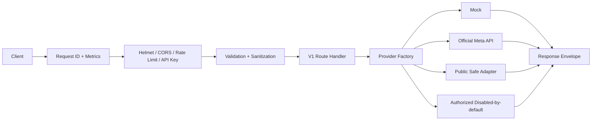
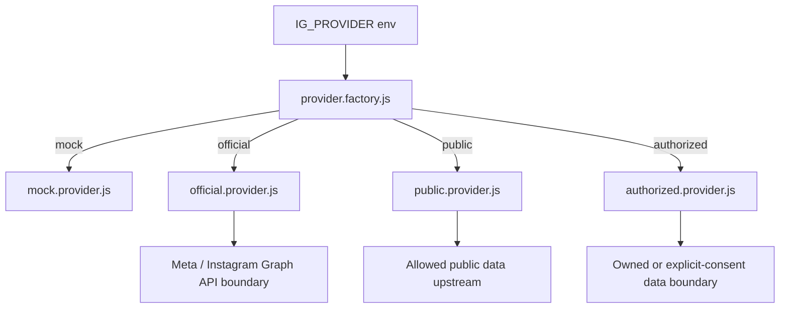
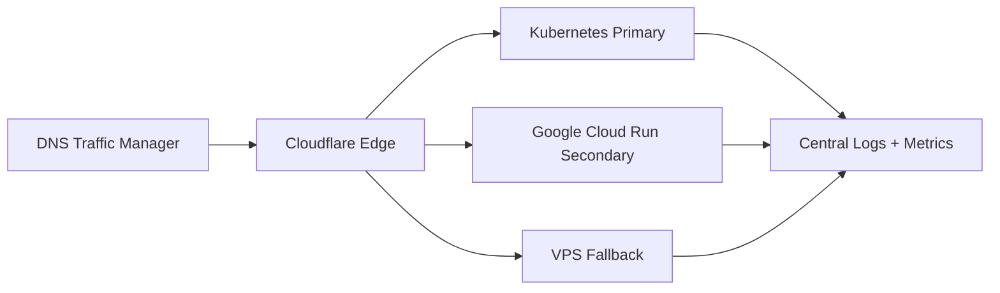

# 🚀 TenRusl Instagram API Gateway Node.js

    

TenRusl Instagram API Gateway adalah template API Node.js production-ready untuk menyatukan kontrak endpoint Instagram berbasis Express, provider adapter, validasi input, observability, Docker, deployment multi-platform, dan dokumentasi operasional.

> ℹ️ **Arti "API full"**  
> Istilah "API full" di project ini berarti **full gateway contract**: route, controller, provider method, validasi, test, dan standard response envelope tersedia konsisten. **Hanya `IG_PROVIDER=mock` yang mengembalikan full contract untuk semua endpoint tanpa credential/upstream live.** Provider non-mock bersifat terbatas sesuai boundary resmi, legal, credential, dan upstream masing-masing.

> 🛡️ **Peringatan Kepatuhan**  
> Project ini tidak menyediakan fitur untuk melewati login, proteksi anti-bot, rate-limit, pencurian sesi, credential stuffing, atau akses data tanpa izin. Gunakan **Instagram Graph API / Meta API resmi** untuk integrasi resmi. Adapter `public` dibatasi untuk data publik yang boleh diakses secara legal dan sesuai ketentuan. Adapter `authorized` hanya untuk data milik sendiri atau izin eksplisit, nonaktif secara default, dan tidak menyimpan password mentah.

## ✨ Fitur Utama

- 🧩 Provider adapter: `mock`, `official`, `public`, `authorized`.
- 🔐 Production hardening: Helmet, CORS configurable, API key optional, rate limit, request ID, body limit, sanitization, error handler global.
- 📊 Observability: `/health`, `/ready`, `/live`, `/metrics` bergaya Prometheus + JSON.
- 🧭 Penemuan kapabilitas: `/capabilities` menampilkan mode provider aktif dan dukungan operasi aman.
- 🧪 Bisa dites tanpa credential Instagram asli memakai `IG_PROVIDER=mock`.
- ⚙️ ESM, Express.js, Node.js 24 LTS utama, kompatibel dengan Node.js 22.
- 📦 Docker, Docker Compose, Kubernetes, VPS, Cloudflare proxy, GitHub Actions, Google Cloud, AWS, Heroku-style Procfile, Render, Railway, Vercel, Netlify, hybrid multi-cloud.
- 🧾 Standard response envelope untuk sukses dan error.

## 🧩 Provider Mode

| Provider | Env | Status default | Cocok untuk | Catatan |
|---|---|---:|---|---|
| Mock | `IG_PROVIDER=mock` | Aktif | Pengembangan lokal, demo, CI/CD, preview deploy | Semua endpoint bisa dites, action selalu dry-run |
| Official | `IG_PROVIDER=official` | Partial | Akun Business/Creator resmi | Boundary Meta Graph API untuk akun/profil/insight milik `META_IG_USER_ID`; endpoint lain error eksplisit |
| Public | `IG_PROVIDER=public` | Nonaktif | Upstream data publik yang compliant | Membutuhkan `PUBLIC_DATA_ENABLED=true` dan upstream milik sendiri; endpoint write/private ditolak |
| Authorized | `IG_PROVIDER=authorized` | Nonaktif | Data milik sendiri/berizin eksplisit tingkat lanjut | Belum siap produksi; operasi live error eksplisit sampai integrasi yang direview ditambahkan |

Detail provider ada di [`docs/PROVIDERS.md`](docs/PROVIDERS.md).

### Legenda Status Endpoint

| Status | Arti |
|---|---|
| ✅ Siap | Implementasi siap pada boundary provider tersebut. |
| ◐ Partial | Sebagian didukung; bergantung scope/field/upstream atau hanya subset contract. |
| 🧪 Dry-run | Contract menerima request dan mengembalikan respons aman tanpa mengeksekusi write/live action. |
| 🔐 Butuh credential/upstream | Membutuhkan token, scope, ID akun, upstream compliant, atau konfigurasi provider. |
| ⛔ Nonaktif | Ditolak eksplisit atau belum diimplementasikan untuk provider tersebut. |

### Matrix Status Endpoint per Provider

| Grup endpoint | Mock | Official | Public | Authorized |
|---|---:|---:|---:|---:|
| Sistem: `/health`, `/live` | ✅ Ready | ✅ Ready | ✅ Ready | ✅ Ready |
| Readiness/kapabilitas: `/ready`, `/capabilities` | ✅ Ready | 🔐 Butuh env Meta; ◐ readiness | 🔐 Butuh upstream compliant; ◐ readiness | ⛔ Disabled sampai integrasi direview |
| Metrics: `/metrics` | ✅ Ready | ✅ Ready | ✅ Ready | ✅ Ready |
| Akun/profil: `/v1/get/accounts/*`, `/v1/get/profiles/*` | ✅ Ready | ◐ Partial; 🔐 credential/scope akun Meta | ◐ Bergantung upstream; 🔐 upstream compliant | ⛔ Disabled |
| Followers/following | ✅ Ready | ⛔ Disabled; tidak didukung boundary aman Meta di project ini | ◐ Bergantung upstream; 🔐 upstream compliant | ⛔ Disabled |
| Baca media: photos/feeds/statuses/posts/reels/media by user/link/id | ✅ Ready | ⛔ Disabled kecuali read spesifik provider yang didukung | ◐ Bergantung upstream; 🔐 upstream compliant | ⛔ Disabled |
| Baca komentar | ✅ Ready | ⛔ Disabled kecuali scope resmi ditambahkan di masa depan | ◐ Bergantung upstream; 🔐 upstream compliant | ⛔ Disabled |
| Discovery: mentions, hashtag media | ✅ Ready | ⛔ Disabled kecuali scope resmi ditambahkan di masa depan | ◐ Bergantung upstream; 🔐 upstream compliant | ⛔ Disabled |
| Insights | ✅ Ready | ◐ Partial; 🔐 credential Meta, IG user ID, scope disetujui | ⛔ Disabled | ⛔ Disabled |
| Messaging/conversations | ✅ Ready | ⛔ Disabled kecuali scope Messenger/IG resmi ditambahkan | ⛔ Disabled | ⛔ Disabled |
| Write/action: follow, unfollow, publish, reply comment, send message | 🧪 Dry-run only | ⛔ Disabled; tidak ada boundary write/automation | ⛔ Disabled/read-only | ⛔ Disabled sampai integrasi consent direview |

### Matrix Kapabilitas Endpoint Provider

| Provider | Kontrak route penuh | Data live | Write/action | Credential/upstream | Kapan dipakai |
|---|---:|---:|---:|---:|---|
| `mock` | ✅ Semua endpoint | Tidak; data deterministik lokal | 🧪 Selalu dry-run | Tidak perlu | Pengembangan, demo, CI/CD, preview deploy, audit kontrak route |
| `official` | ✅ Contract tersedia, live hanya subset | ◐ Partial via Meta Graph API | ⛔ Disabled | 🔐 `META_ACCESS_TOKEN`, `META_IG_USER_ID`, Graph API env, scope resmi | Integrasi resmi Business/Creator untuk read yang didukung |
| `public` | ✅ Contract tersedia, hasil bergantung upstream | ◐ Bergantung upstream compliant | ⛔ Disabled/read-only | 🔐 `PUBLIC_DATA_ENABLED=true`, `PUBLIC_DATA_UPSTREAM_URL` | Proxy ke upstream data publik yang legal dan dikontrol deployer |
| `authorized` | ✅ Contract tersedia, live belum aktif | ⛔ Disabled | ⛔ Disabled | 🔐 Env + review + implementasi consent nyata | Placeholder untuk integrasi owned/explicit-consent yang sudah direview |

| Area kemampuan | Mock | Official | Public | Authorized |
|---|---:|---:|---:|---:|
| Kontrak route/controller/provider lengkap | ✅ | ✅ | ✅ | ✅ |
| Response envelope standar | ✅ | ✅ | ✅ | ✅ |
| Account/profile read | ✅ | ◐ Partial + 🔐 | ◐ Upstream + 🔐 | ⛔ |
| Relation/media/comment/discovery read | ✅ | ⛔/future scope | ◐ Upstream + 🔐 | ⛔ |
| Insight read | ✅ | ◐ Partial + 🔐 | ⛔ | ⛔ |
| Messaging | ✅ mock data | ⛔ | ⛔ | ⛔ |
| Write/action live | ⛔ tidak live | ⛔ | ⛔ | ⛔ |
| Write/action dry-run | 🧪 | ⛔ | ⛔ | ⛔ |

`mock` adalah satu-satunya mode yang cocok untuk klaim "full endpoint contract" di local/dev/CI karena semua route mengembalikan envelope deterministik. Untuk data live production, baca matrix di atas sebagai batas implementasi provider, bukan janji bahwa semua fitur Instagram tersedia.

## 🧱 Arsitektur

```txt
Client -> Express App -> Security Middleware -> Validation -> V1 Routes -> Provider Factory -> Provider Adapter -> Standard Envelope
```





```mermaid
flowchart LR
  DEV[Local] --> IMG[Container Image]
  IMG --> DOCKER[Docker Compose]
  IMG --> K8S[Kubernetes]
  IMG --> CLOUD[Cloud Run / AWS / Render / Railway]
  EDGE[Cloudflare / Vercel / Netlify] --> ORIGIN[API Origin]
  K8S --> METRICS[/metrics]
  CLOUD --> METRICS
  DOCKER --> METRICS
```



Detail arsitektur ada di [`docs/ARCHITECTURE.md`](docs/ARCHITECTURE.md).

## ⚡ Mulai Cepat Lokal

```bash
npm install
cp .env.local.example .env
npm run check
npm test
npm run doctor
npm run dev
```

Windows PowerShell:

```powershell
npm install
Copy-Item .env.local.example .env
npm run check
npm test
npm run doctor
npm run dev
```

Buka:

```bash
curl http://localhost:3000/health
curl http://localhost:3000/ready
curl http://localhost:3000/v1/get/profiles/tenrusl
```

Path root `/` menyajikan halaman status statis dari `public/index.html`. Route API tetap berada di `/health`, `/ready`, `/live`, `/metrics`, `/capabilities`, `/v1`, dan `/api/v1`.

## ⚙️ Pengaturan Environment

Minimal lokal:

```env
NODE_ENV=development
PORT=3000
HOST=0.0.0.0
TRUST_PROXY=1
IG_PROVIDER=mock
CORS_ORIGIN=http://localhost:3000,http://127.0.0.1:3000
API_KEY_ENABLED=false
METRICS_PUBLIC=false
CAPABILITIES_PUBLIC=false
RATE_LIMIT_ENABLED=true
RATE_LIMIT_WINDOW_MS=60000
RATE_LIMIT_MAX=120
BODY_LIMIT=256kb
DEFAULT_LIMIT=25
MAX_LIMIT=100
PROVIDER_REQUEST_TIMEOUT_MS=10000
GRACEFUL_SHUTDOWN_MS=10000
```

Provider official:

```env
IG_PROVIDER=official
META_GRAPH_BASE_URL=https://graph.facebook.com
META_API_VERSION=v23.0
META_ACCESS_TOKEN=your_meta_access_token
META_IG_USER_ID=your_instagram_business_or_creator_user_id
PROVIDER_REQUEST_TIMEOUT_MS=10000
```

Mode aman provider public:

```env
IG_PROVIDER=public
PUBLIC_DATA_ENABLED=true
PUBLIC_DATA_UPSTREAM_URL=https://your-compliant-public-data-upstream.example
PROVIDER_REQUEST_TIMEOUT_MS=10000
```

Mode lanjutan provider authorized:

```env
IG_PROVIDER=authorized
AUTHORIZED_PROVIDER_ENABLED=false
AUTHORIZED_SESSION_TOKEN=
AUTHORIZED_INTEGRATION_REVIEWED=false
```

Runtime env yang dibaca aplikasi ada di `src/config/env.js`. Detail lengkap ada di [`docs/ENVIRONMENT.md`](docs/ENVIRONMENT.md). Legacy env `APP_MODE`, `SCRAPER_ENABLED`, `CACHE_ENABLED`, `PUPPETEER_HEADLESS`, dan `META_API_ENABLED` sudah deprecated dan tidak dipakai runtime Express.

## 🧪 Menjalankan Development, Produksi, dan Test

```bash
npm run dev        # jalankan src/server.js dengan mode pantau
npm start          # jalankan mode start bergaya produksi
npm run check      # cek sintaks titik masuk
npm run lint       # pemindaian dasar pola rahasia/tidak aman
npm test           # jalankan rangkaian pengujian node:test
npm run smoke:get  # jalankan smoke test semua endpoint GET dengan IG_PROVIDER=mock
npm run doctor     # cek kesiapan waktu jalan dan struktur
npm run verify     # jalankan check + lint + test + doctor
```

`npm run smoke:get` menjalankan server lokal sementara dalam mode `IG_PROVIDER=mock`, memanggil seluruh endpoint `GET` canonical dan alias kompatibilitas, lalu menampilkan ringkasan total endpoint, distribusi status code, dan daftar endpoint yang gagal.

## 🧾 Response Standar

Sukses:

```json
{
  "success": true,
  "data": {},
  "meta": {},
  "error": null
}
```

Error:

```json
{
  "success": false,
  "data": null,
  "meta": {},
  "error": {
    "code": "ERROR_CODE",
    "message": "Human readable message",
    "details": {}
  }
}
```

## 📚 Tabel Endpoint

| Kategori | Method | Endpoint | Catatan |
|---|---:|---|---|
| Sistem | GET | `/health` | status service |
| Sistem | GET | `/ready` | readiness + peringatan provider |
| Sistem | GET | `/live` | liveness |
| Sistem | GET | `/metrics` | teks Prometheus, `?format=json` untuk JSON |
| Sistem | GET | `/capabilities` | provider aktif dan kapabilitas operasi yang didukung |
| Accounts | GET | `/v1/get/accounts/:identifier` | ID atau username |
| Profiles | GET | `/v1/get/profiles/:identifier` | ID atau username |
| Profiles | GET | `/v1/get/profiles/by-link?link=` | link profile Instagram |
| Followers | GET | `/v1/get/followers/:identifier` | `limit`, `page`, `cursor`, `all` |
| Following | GET | `/v1/get/following/:identifier` | `limit`, `page`, `cursor`, `all` |
| Actions | POST | `/v1/actions/follow/:identifier` | dry-run default |
| Actions | POST | `/v1/actions/unfollow/:identifier` | dry-run default |
| Photos | GET | `/v1/get/photos/users/:identifier` | user photos |
| Photos | GET | `/v1/get/photos/by-link?link=` | by post/reel/story link |
| Feeds | GET | `/v1/get/feeds/users/:identifier` | user feeds |
| Feeds | GET | `/v1/get/feeds/by-link?link=` | by link |
| Statuses | GET | `/v1/get/statuses/users/:identifier` | user statuses/stories contract |
| Statuses | GET | `/v1/get/statuses/by-link?link=` | supports `/stories/...` |
| Posts | GET | `/v1/get/posts/users/:identifier` | user posts |
| Posts | GET | `/v1/get/posts/:id` | detail by Post ID |
| Posts | GET | `/v1/get/posts/by-link?link=` | detail by link |
| Reels | GET | `/v1/get/reels/users/:identifier` | user reels |
| Reels | GET | `/v1/get/reels/by-link?link=` | by link |
| Media | GET | `/v1/get/media/users/:identifier` | all/limit media |
| Media | GET | `/v1/get/media/by-link?link=` | by link |
| Publish | POST | `/v1/publish/media` | `mediaUrl`, `mediaType`, `caption`, dry-run |
| Publish | POST | `/v1/publish/reels` | dry-run |
| Publish | POST | `/v1/publish/photos` | dry-run |
| Publish | POST | `/v1/publish/feeds` | dry-run |
| Publish | POST | `/v1/publish/statuses` | dry-run |
| Comments | GET | `/v1/comments?link=` | comments by link optional |
| Comments | POST | `/v1/comments/:id/reply` | dry-run |
| Comments | POST | `/v1/comments/reply` | body `id` or `link`, dry-run; `id` wins if both are sent |
| Discovery | GET | `/v1/mentions` | mentions contract |
| Discovery | GET | `/v1/hashtags/media?hashtag=` | hashtag media |
| Insights | GET | `/v1/insights` | official provider recommended |
| Messaging | GET | `/v1/conversations` | conversations |
| Messaging | GET | `/v1/messages` | all/limit messages |
| Messaging | GET | `/v1/messages/:id` | thread messages |
| Messaging | POST | `/v1/messages/:id/send` | dry-run |

Route API canonical memakai `/v1`. Alias kompatibilitas di `/api/v1` dan beberapa path lama `/v1/*` didokumentasikan di [`docs/API.md`](docs/API.md).

## 🧪 Contoh Curl

Sistem:

```bash
curl http://localhost:3000/health
curl http://localhost:3000/ready
curl http://localhost:3000/live
curl http://localhost:3000/metrics
curl http://localhost:3000/capabilities
```

Akun dan profil:

```bash
curl http://localhost:3000/v1/get/accounts/tenrusl
curl http://localhost:3000/v1/get/accounts/123456
curl http://localhost:3000/v1/get/profiles/tenrusl
curl "http://localhost:3000/v1/get/profiles/by-link?link=https://www.instagram.com/tenrusl/"
```

Followers dan following:

```bash
curl "http://localhost:3000/v1/get/followers/tenrusl?limit=25"
curl "http://localhost:3000/v1/get/following/123456?limit=25&cursor=next"
```

Action:

```bash
curl -X POST http://localhost:3000/v1/actions/follow/tenrusl \
  -H "content-type: application/json" \
  -d '{"dryRun":true}'

curl -X POST http://localhost:3000/v1/actions/unfollow/123456 \
  -H "content-type: application/json" \
  -d '{"dryRun":true}'
```

Konten user dan media:

```bash
curl "http://localhost:3000/v1/get/photos/users/tenrusl?limit=10"
curl "http://localhost:3000/v1/get/feeds/users/tenrusl?all=true&limit=5"
curl "http://localhost:3000/v1/get/statuses/by-link?link=https://www.instagram.com/stories/tenrusl/123456/"
curl "http://localhost:3000/v1/get/posts/by-link?link=https://www.instagram.com/p/ABC123def45/"
curl http://localhost:3000/v1/get/posts/post_123
curl "http://localhost:3000/v1/get/reels/users/tenrusl?limit=5"
curl "http://localhost:3000/v1/get/media/users/123456?limit=5"
```

Publishing:

```bash
curl -X POST http://localhost:3000/v1/publish/media \
  -H "content-type: application/json" \
  -d '{"mediaUrl":"https://example.com/image.jpg","mediaType":"IMAGE","caption":"Dry run","dryRun":true}'
```

Komentar:

```bash
curl "http://localhost:3000/v1/comments?link=https://www.instagram.com/p/ABC123def45/"
curl -X POST http://localhost:3000/v1/comments/comment_123/reply \
  -H "content-type: application/json" \
  -d '{"text":"Thanks!","dryRun":true}'
curl -X POST http://localhost:3000/v1/comments/reply \
  -H "content-type: application/json" \
  -d '{"id":"comment_123","text":"Thanks!","dryRun":true}'
curl -X POST http://localhost:3000/v1/comments/reply \
  -H "content-type: application/json" \
  -d '{"link":"https://www.instagram.com/p/ABC123def45/","text":"Thanks!","dryRun":true}'
```

`/v1/comments/reply` body:

```json
{
  "id": "comment_123",
  "link": "https://www.instagram.com/p/ABC123def45/",
  "text": "Thanks!",
  "dryRun": true
}
```

Minimal salah satu dari `id` atau `link` wajib dikirim. Jika keduanya ada, `id` dipakai sebagai target reply karena lebih eksplisit dan menghindari ambiguitas URL. `link` harus berupa URL Instagram post, reel, tv, atau story yang didukung. Gateway ini tidak melakukan scraping atau bypass login.

Discovery, insight, dan pesan:

```bash
curl http://localhost:3000/v1/mentions
curl "http://localhost:3000/v1/hashtags/media?hashtag=tenrusl"
curl http://localhost:3000/v1/insights
curl http://localhost:3000/v1/conversations
curl "http://localhost:3000/v1/messages?limit=20"
curl http://localhost:3000/v1/messages/thread_123
curl -X POST http://localhost:3000/v1/messages/thread_123/send \
  -H "content-type: application/json" \
  -d '{"username":"tenrusl","text":"Hello","dryRun":true}'
```

PowerShell:

```powershell
curl.exe http://localhost:3000/health
curl.exe http://localhost:3000/ready
curl.exe http://localhost:3000/capabilities
curl.exe http://localhost:3000/v1/get/profiles/tenrusl
curl.exe "http://localhost:3000/v1/get/posts/by-link?link=https://www.instagram.com/p/ABC123def45/"
curl.exe -X POST http://localhost:3000/v1/comments/reply -H "content-type: application/json" -d "{\"id\":\"comment_123\",\"text\":\"Thanks!\",\"dryRun\":true}"
curl.exe -X POST http://localhost:3000/v1/publish/media -H "content-type: application/json" -d "{\"mediaUrl\":\"https://example.com/image.jpg\",\"mediaType\":\"IMAGE\",\"caption\":\"Dry run\",\"dryRun\":true}"
```

## 🧭 Pagination

Endpoint collection menerima:

- `limit`: jumlah item, default `25`, maksimum sesuai `MAX_LIMIT`.
- `page`: halaman numerik untuk adapter yang mendukung page-based pagination.
- `cursor`: cursor untuk adapter yang mendukung cursor pagination.
- `all`: boolean. Dalam mock mode tetap dibatasi agar aman untuk test.

## 🛡️ Mode Dry-run

Semua endpoint `POST` yang berjalan dengan `IG_PROVIDER=mock` adalah dry-run paksa. Ini mencakup follow, unfollow, publish media/reels/photos/feeds/statuses, reply comment, dan send message.

Dalam mode `mock`:

- Request `POST` tidak pernah memanggil Instagram, Meta Graph API, upstream public data, browser automation, session, token live, atau integrasi write eksternal apa pun.
- Request body `{"dryRun": false}` hanya dicatat sebagai permintaan caller; hasil provider tetap mengembalikan `dryRun: true` dan status `dry-run`.
- Tidak ada state Instagram yang dibuat, diubah, dihapus, difollow, di-unfollow, dipublish, dibalas, atau dikirimi pesan.
- Response mock boleh berisi `accepted: true` untuk menandakan kontrak request valid, bukan berarti operasi live dieksekusi.

Operasi write live hanya boleh ditambahkan melalui adapter non-mock yang eksplisit, sudah direview, punya izin resmi/consent yang sesuai, dan dilindungi test kontrak agar route tidak diam-diam berubah menjadi write sungguhan.

## 📊 Metrics

`GET /metrics` mengembalikan text Prometheus-style:

- `tenrusl_up`
- `tenrusl_uptime_seconds`
- `tenrusl_requests_total`
- `tenrusl_memory_rss_bytes`
- `tenrusl_node_info`
- `tenrusl_provider_ready`

Gunakan `GET /metrics?format=json` untuk output JSON.

## 🔐 Rate Limit

Internal rate limit aktif default:

- `RATE_LIMIT_ENABLED=true`
- `RATE_LIMIT_WINDOW_MS=60000`
- `RATE_LIMIT_MAX=120`

Response menyertakan `X-RateLimit-Limit`, `X-RateLimit-Remaining`, `X-RateLimit-Reset`, dan `Retry-After` saat `429`. Untuk production multi-instance, gunakan Redis, API gateway quota, atau WAF-level distributed rate limit.

## ☁️ Tutorial Deployment Ringkas

### Local

Cocok untuk development.

```bash
npm install
npm run dev
```

Health check: `http://localhost:3000/health`.

### Docker

```bash
docker build -t tenrusl-instagram-api:production .
docker run --env-file .env -p 3000:3000 tenrusl-instagram-api:production
```

Image memakai `npm ci --omit=dev`, healthcheck `/health`, dan non-root user.

### Docker Compose

```bash
cp .env.example .env
docker compose up --build
```

### Cloudflare

Gunakan Worker sebagai edge proxy ke origin container. File: `deploy/cloudflare/worker.js`. Worker membutuhkan `ORIGIN_BASE_URL`.

### GitHub Actions

Gunakan workflow aktif di `.github/workflows/ci.yml`. Workflow menjalankan `check`, `lint`, `test`, dan `doctor` pada Node.js 22 dan 24.

### Google Cloud

Gunakan Cloud Run dengan container image dan env `NODE_ENV=production`, `IG_PROVIDER=mock|official`. File: `deploy/google-cloud/cloud-run.yaml`. Root `app.yaml` tersedia untuk App Engine, dan `cloudbuild.yaml` untuk build image.

### AWS

Gunakan App Runner atau ECS. File: `deploy/aws/apprunner.yaml`.

### Heroku-style Procfile

Gunakan root `Procfile`:

```bash
heroku config:set NODE_ENV=production IG_PROVIDER=mock
```

### Render

Gunakan `render.yaml`. Health check path: `/health`. Secret harus diisi dari Render dashboard untuk field `sync:false`.

### Railway

Gunakan `railway.json`. Start command: `npm start`. Runtime env diatur melalui Railway Variables.

### Vercel / Netlify

Cocok untuk serverless preview. Untuk traffic produksi stabil, container lebih disarankan. File aktif: root `vercel.json` dan `netlify.toml`.

### VPS

Gunakan reverse proxy Nginx dan systemd. File: `deploy/vps/nginx.conf`, `deploy/vps/systemd.service`. Secret disimpan di environment file luar git.

### Kubernetes

```bash
kubectl apply -f deploy/kubernetes/
```

Readiness: `/ready`, liveness: `/live`. Template Kubernetes sudah memiliki ConfigMap, Secret example, resource requests, dan resource limits.

### Hybrid Multi-Cloud

Gunakan image yang sama lintas Kubernetes, Cloud Run, dan VPS fallback. DNS/edge melakukan failover berdasarkan health check.

Detail deployment ada di [`docs/DEPLOYMENT.md`](docs/DEPLOYMENT.md).

## ✅ Checklist Rilis

- Environment production lengkap dan berasal dari secret manager, bukan `.env.example`.
- `IG_PROVIDER` dipilih secara sadar: `mock`, `official`, `public`, atau `authorized`.
- `API_KEY_ENABLED=true` dan `API_KEY` kuat untuk API publik, atau ada proteksi gateway upstream setara.
- `CORS_ORIGIN` dibatasi ke domain production.
- `RATE_LIMIT_ENABLED=true`; gunakan distributed limiter untuk multi-instance.
- `METRICS_PUBLIC=false` dan `CAPABILITIES_PUBLIC=false` kecuali dilindungi upstream.
- `npm run check`, `npm run lint`, `npm test`, dan `npm run doctor` lulus di CI.
- Deployment target memakai config aktif yang benar: `Dockerfile`, `docker-compose.yml`, `.github/workflows/ci.yml`, `Procfile`, `render.yaml`, `railway.json`, `vercel.json`, atau `netlify.toml`.
- Health check target memakai `/health`, readiness memakai `/ready`, dan liveness memakai `/live`.
- `IG_PROVIDER=mock` tidak dipakai untuk production live data kecuali sengaja untuk preview/demo tanpa data live.
- Provider non-mock sudah diuji dengan env wajib dan batasan legal/compliance masing-masing.

## 🔐 Catatan Keamanan

- Jangan expose `API_KEY`, `META_ACCESS_TOKEN`, `AUTHORIZED_SESSION_TOKEN`, atau secret provider lain.
- Batasi `CORS_ORIGIN` di production.
- Aktifkan `API_KEY_ENABLED=true` atau proteksi gateway upstream.
- Simpan secret di secret manager platform.
- Pantau `/metrics` dan logs JSON.
- Jangan menambahkan bypass login, credential stuffing, anti-bot evasion, scraping agresif, atau penyimpanan password mentah.

Detail security ada di [`docs/SECURITY.md`](docs/SECURITY.md).

## 🧯 Pemecahan Masalah

| Masalah | Solusi |
|---|---|
| Port `3000` sudah dipakai | Set `PORT=3001` di `.env`, lalu restart server |
| `401 UNAUTHORIZED` | Jika `API_KEY_ENABLED=true`, kirim `x-api-key` atau `Authorization: Bearer <key>` |
| `/ready` degraded atau `503` | Periksa `IG_PROVIDER` dan env provider terkait |
| 400 username invalid | Username hanya huruf, angka, titik, underscore; tanpa titik ganda/trailing |
| 400 link invalid | Gunakan link Instagram `p`, `reel`, `tv`, `stories`, atau profile |
| 429 rate limit | Hormati `Retry-After`, gunakan backoff, atau naikkan `RATE_LIMIT_MAX` untuk local |
| Official provider not configured | Isi `META_GRAPH_BASE_URL`, `META_API_VERSION`, `META_ACCESS_TOKEN`, dan `META_IG_USER_ID` |
| Public provider disabled | Set `PUBLIC_DATA_ENABLED=true` dan `PUBLIC_DATA_UPSTREAM_URL` yang valid |
| Authorized disabled | Set `AUTHORIZED_PROVIDER_ENABLED=true`, `AUTHORIZED_SESSION_TOKEN`, `AUTHORIZED_INTEGRATION_REVIEWED=true`, lalu implementasikan integrasi reviewed sebelum production |
| CORS blocked | Set `CORS_ORIGIN` ke origin frontend, misalnya `http://localhost:5173,http://localhost:3000` |

## 📁 Struktur Folder Detail

Struktur ini dibuat agar alur `server -> app -> middleware -> router -> controller -> provider -> response envelope` mudah diaudit.

```txt
.
├── src
│   ├── app.js                         # Membuat Express app, memasang middleware, route, static page, not-found, dan error handler
│   ├── server.js                      # Entry point HTTP server, listen port, graceful shutdown
│   ├── config
│   │   └── env.js                     # Normalisasi dan validasi environment variable runtime
│   ├── routes
│   │   ├── index.js                   # Router root untuk health, ready, live, metrics, capabilities, /v1, dan alias /api/v1
│   │   └── v1.routes.js               # Kontrak route Instagram canonical dan legacy alias
│   ├── modules
│   │   ├── account.controller.js      # Controller akun: validasi identifier lalu panggil provider getAccount
│   │   ├── action.controller.js       # Controller action follow/unfollow safe contract
│   │   ├── comment.controller.js      # Controller komentar dan reply dry-run
│   │   ├── discovery.controller.js    # Controller mentions dan hashtag media
│   │   ├── insight.controller.js      # Controller insight provider-specific
│   │   ├── media.controller.js        # Controller media/content/publish/post by id/link
│   │   ├── message.controller.js      # Controller conversations, messages, thread, send message
│   │   ├── profile.controller.js      # Controller profil by identifier/link
│   │   └── relation.controller.js     # Controller followers/following
│   ├── providers
│   │   └── instagram
│   │       ├── index.js               # Export provider factory, contract, capabilities, dan adapter provider
│   │       ├── provider.factory.js    # Memilih provider dari IG_PROVIDER dan cache instance aktif
│   │       ├── provider.contract.js   # Daftar method wajib agar controller/provider tidak putus diam-diam
│   │       ├── capabilities.js        # Metadata kemampuan tiap provider
│   │       ├── mock.provider.js       # Provider default: full contract, data deterministik, write selalu dry-run
│   │       ├── official.provider.js   # Boundary resmi Meta/Instagram Graph API, partial sesuai scope/env
│   │       ├── public.provider.js     # Boundary upstream publik compliant, read-only dan bergantung upstream
│   │       └── authorized.provider.js # Placeholder disabled-by-default untuk data owned/consented yang direview
│   ├── middlewares
│   │   ├── api-key.middleware.js      # Proteksi API key via x-api-key atau Authorization Bearer
│   │   ├── cors.middleware.js         # CORS allowlist berdasarkan CORS_ORIGIN
│   │   ├── error.middleware.js        # Mengubah AppError/error umum menjadi standard response envelope
│   │   ├── metrics.middleware.js      # Counter request dan metrics runtime
│   │   ├── not-found.middleware.js    # 404 standar saat route tidak ditemukan
│   │   ├── rate-limit.middleware.js   # Rate limit in-memory aman untuk single instance/local
│   │   ├── request-id.middleware.js   # Request ID untuk trace log dan response header
│   │   └── security.middleware.js     # Helmet, body parser limit, sanitasi, dan hardening dasar
│   ├── schemas
│   │   └── instagram.schema.js        # Schema Zod untuk identifier, pagination, link, publish, action, message
│   ├── services
│   │   └── logger.js                  # Logger JSON sederhana untuk request/error/runtime
│   ├── serverless
│   │   └── handler.js                 # Adapter serverless untuk platform seperti Netlify/Vercel
│   ├── utils
│   │   ├── app-error.js               # AppError dengan statusCode, code, details
│   │   ├── async-handler.js           # Wrapper async controller agar error masuk middleware global
│   │   ├── comment-target.js          # Normalisasi target reply komentar dari id atau link
│   │   ├── envelope.js                # Helper success/error response envelope
│   │   ├── instagram-url.js           # Parser dan validasi URL Instagram
│   │   ├── pagination.js              # Helper pagination limit/page/cursor/all
│   │   ├── provider-error.js          # Error provider untuk disabled/upstream/not implemented
│   │   ├── sanitize.js                # Sanitasi input umum
│   │   └── validation.js              # Helper validasi request berbasis schema
│   └── tests
│       ├── api-smoke.test.js          # Smoke/contract test endpoint GET/POST dan envelope
│       ├── gateway-contract.test.js   # Test kontrak provider method, controller factory, dan wiring router
│       ├── health.test.js             # Test health/ready/live/metrics/status page
│       ├── providers.test.js          # Test provider factory dan boundary provider
│       ├── security.test.js           # Test API key dan rate limit
│       └── v1-routes.test.js          # Test route canonical, alias legacy, validasi, dan error envelope
├── docs
│   ├── API.md                         # Referensi endpoint, response envelope, legacy alias, dan matrix status provider
│   ├── ARCHITECTURE.md                # Alur arsitektur Express, provider, deployment, dan observability
│   ├── DEPLOYMENT.md                  # Panduan deployment multi-platform
│   ├── ENVIRONMENT.md                 # Daftar environment variable runtime
│   ├── PROVIDERS.md                   # Detail provider adapter, capability, dan readiness
│   └── SECURITY.md                    # Hardening, compliance, API key, CORS, rate limit
├── deploy
│   ├── aws                            # Template AWS App Runner/ECS
│   ├── cloudflare                     # Worker edge proxy
│   ├── docker                         # Catatan dan konfigurasi Docker tambahan
│   ├── github                         # Materi deployment GitHub/GitHub Actions
│   ├── google-cloud                   # Cloud Run/App Engine/Cloud Build
│   ├── heroku                         # Deployment Heroku-style
│   ├── hybrid-multicloud              # Pola failover multi-cloud
│   ├── kubernetes                     # Manifest ConfigMap, Secret, Deployment, Service, probes
│   ├── netlify                        # Konfigurasi serverless/edge Netlify
│   ├── railway                        # Konfigurasi Railway
│   ├── render                         # Konfigurasi Render
│   ├── vercel                         # Konfigurasi Vercel
│   └── vps                            # Nginx dan systemd untuk VPS
├── scripts
│   ├── api-smoke.js                   # Runner smoke test GET endpoint saat server lokal berjalan
│   ├── doctor.js                      # Pemeriksaan struktur, env, dan kesiapan runtime
│   └── lint-basic.js                  # Lint dasar untuk pola secret/tidak aman
├── public
│   ├── index.html                     # Halaman status statis untuk route /
│   └── favicon.svg                    # Ikon status page
├── netlify
│   └── functions
│       └── api.js                     # Entry serverless Netlify
├── .dockerignore                      # File yang diabaikan saat build image
├── .gitignore                         # File lokal/secret/cache yang tidak masuk git
├── app.yaml                           # Konfigurasi App Engine
├── cloudbuild.yaml                    # Build image Google Cloud Build
├── docker-compose.yml                 # Stack lokal/container
├── Dockerfile                         # Image produksi Node.js non-root
├── netlify.toml                       # Routing/build Netlify
├── package.json                       # Script npm, dependency, metadata ESM
├── package-lock.json                  # Lock dependency npm
├── Procfile                           # Start command Heroku-style
├── railway.json                       # Konfigurasi Railway
├── render.yaml                        # Konfigurasi Render
├── vercel.json                        # Konfigurasi Vercel serverless
├── README.md                          # Dokumentasi utama berbahasa Indonesia
├── SECURITY.md                        # Security policy repository
├── CONTRIBUTING.md                    # Panduan kontribusi
└── LICENSE                            # Lisensi MIT
```

Catatan audit struktur:

- `src/routes/v1.routes.js` adalah titik utama untuk menambah route.
- Controller di `src/modules/*` harus memanggil method provider yang didefinisikan di `provider.contract.js`.
- Provider baru atau method baru wajib ditutup test di `src/tests/gateway-contract.test.js` dan smoke test agar route tidak putus diam-diam.
- Semua response JSON harus melewati helper envelope dan error middleware agar format tetap konsisten.

## 📚 Dokumentasi Detail

- [`docs/API.md`](docs/API.md): detail endpoint, envelope standar, validasi, dan alias legacy.
- [`docs/ENVIRONMENT.md`](docs/ENVIRONMENT.md): semua environment variable yang dibaca runtime.
- [`docs/PROVIDERS.md`](docs/PROVIDERS.md): perilaku provider, kapabilitas, dan kesiapan produksi.
- [`docs/DEPLOYMENT.md`](docs/DEPLOYMENT.md): matrix deployment, env per platform, dan checklist.
- [`docs/SECURITY.md`](docs/SECURITY.md): hardening, rate limit, API key, dan kepatuhan.
- [`SECURITY.md`](SECURITY.md): kebijakan keamanan.
- [`CONTRIBUTING.md`](CONTRIBUTING.md): alur kontribusi.

## 🧬 Roadmap

- Client Official Meta Graph API untuk endpoint yang didukung dan sudah mendapat scope resmi.
- Test kontrak OpenAPI.
- Adapter cache dan antrean untuk job asynchronous yang aman.
- Distributed rate limit dengan Redis.
- Dashboard metrics.
- Contoh integrasi secret manager.

## ❓ FAQ

**Apakah endpoint bisa dites tanpa token Instagram?**  
Bisa. Gunakan `IG_PROVIDER=mock`.

**Apakah action follow/unfollow benar-benar dieksekusi?**  
Tidak secara default. Semua action dry-run untuk mencegah automation berisiko.

**Apakah official provider sudah membuat semua endpoint live?**  
Tidak. Provider `official` saat ini hanya partial boundary untuk Meta Graph API reads yang didukung.

**Apakah public adapter melakukan scraping agresif?**  
Tidak. Adapter public hanya boundary aman untuk integrasi data publik yang diizinkan.

**Apakah authorized adapter menyimpan password?**  
Tidak. Adapter ini disabled by default dan tidak menyimpan password mentah.

## 🤝 Panduan Kontribusi

1. Fork repository.
2. Buat branch fitur.
3. Jalankan `npm run check`, `npm run lint`, `npm test`, dan `npm run doctor`.
4. Tambahkan test untuk endpoint/provider baru.
5. Jelaskan risiko compliance di pull request.

## 📄 License

MIT. Lihat `LICENSE`.
