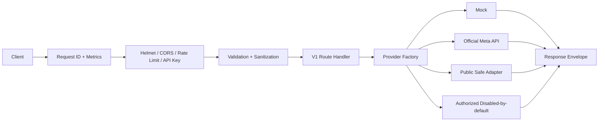
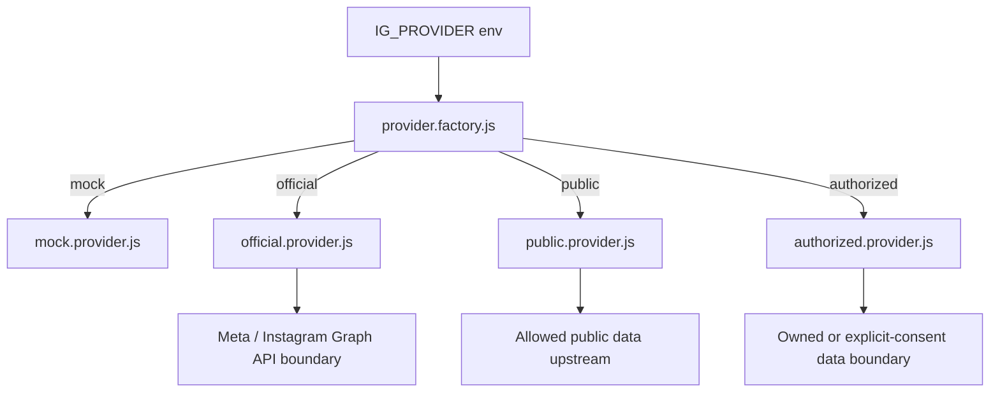
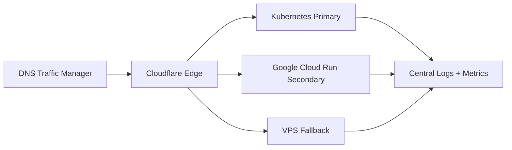

# 🚀 TenRusl Instagram API Gateway Node.js

    

TenRusl Instagram API Gateway adalah template API Node.js production-ready untuk menyatukan kontrak endpoint Instagram berbasis Express, provider adapter, validasi input, observability, Docker, deployment multi-platform, dan dokumentasi operasional.

> 🛡️ **Compliance warning**  
> Project ini tidak menyediakan fitur untuk melewati login, proteksi anti-bot, rate-limit, session theft, credential stuffing, atau akses data tanpa izin. Gunakan **Official Instagram Graph API / Meta API** untuk integrasi resmi. Adapter `public` dibatasi untuk data publik yang boleh diakses secara legal dan sesuai ketentuan. Adapter `authorized` hanya untuk data milik sendiri atau izin eksplisit, disabled by default, dan tidak menyimpan password mentah.

## ✨ Fitur Utama

- 🧩 Provider adapter: `mock`, `official`, `public`, `authorized`.
- 🔐 Production hardening: Helmet, CORS configurable, API key optional, rate limit, request ID, body limit, sanitization, error handler global.
- 📊 Observability: `/health`, `/ready`, `/live`, `/metrics` Prometheus-style + JSON.
- 🧭 Capability discovery: `/capabilities` exposes provider mode and safe operation support.
- 🧪 Testable tanpa credential Instagram asli memakai `IG_PROVIDER=mock`.
- ⚙️ ESM, Express.js, Node.js 24 LTS primary, Node.js 22 compatible.
- 📦 Docker, Docker Compose, Kubernetes, VPS, Cloudflare proxy, GitHub Actions, Google Cloud, AWS, Heroku-style Procfile, Render, Railway, Vercel, Netlify, hybrid multi-cloud.
- 🧾 Standard response envelope untuk sukses dan error.

## 🧩 Provider Mode

| Provider | Env | Status default | Cocok untuk | Catatan |
|---|---|---:|---|---|
| Mock | `IG_PROVIDER=mock` | Aktif | Local dev, demo, CI/CD, preview deploy | Semua endpoint testable, action selalu dry-run |
| Official | `IG_PROVIDER=official` | Partial | Akun Business/Creator resmi | Boundary Meta Graph API untuk account/profile/insights milik `META_IG_USER_ID`; endpoint lain error eksplisit |
| Public | `IG_PROVIDER=public` | Disabled | Upstream data publik yang compliant | Membutuhkan `PUBLIC_DATA_ENABLED=true` dan upstream milik sendiri; write/private endpoints ditolak |
| Authorized | `IG_PROVIDER=authorized` | Disabled | Advanced owned/consented data | Belum production-ready; operasi live error eksplisit sampai integrasi reviewed ditambahkan |

Detail provider ada di [`docs/PROVIDERS.md`](docs/PROVIDERS.md).

## 🧱 Arsitektur

```txt
Client -> Express App -> Security Middleware -> Validation -> V1 Routes -> Provider Factory -> Provider Adapter -> Standard Envelope
```





```mermaid
flowchart LR
  DEV[Local] --> IMG[Container Image]
  IMG --> DOCKER[Docker Compose]
  IMG --> K8S[Kubernetes]
  IMG --> CLOUD[Cloud Run / AWS / Render / Railway]
  EDGE[Cloudflare / Vercel / Netlify] --> ORIGIN[API Origin]
  K8S --> METRICS[/metrics]
  CLOUD --> METRICS
  DOCKER --> METRICS
```



Detail arsitektur ada di [`docs/ARCHITECTURE.md`](docs/ARCHITECTURE.md).

## ⚡ Quick Start Local

```bash
npm install
cp .env.local.example .env
npm run check
npm test
npm run doctor
npm run dev
```

Windows PowerShell:

```powershell
npm install
Copy-Item .env.local.example .env
npm run check
npm test
npm run doctor
npm run dev
```

Buka:

```bash
curl http://localhost:3000/health
curl http://localhost:3000/ready
curl http://localhost:3000/v1/get/profiles/tenrusl
```

The root path `/` serves the static status page from `public/index.html`. API routes stay under `/health`, `/ready`, `/live`, `/metrics`, `/capabilities`, `/v1`, and `/api/v1`.

## ⚙️ Setup Environment

Minimal local:

```env
NODE_ENV=development
PORT=3000
HOST=0.0.0.0
TRUST_PROXY=1
IG_PROVIDER=mock
CORS_ORIGIN=http://localhost:3000,http://127.0.0.1:3000
API_KEY_ENABLED=false
METRICS_PUBLIC=false
CAPABILITIES_PUBLIC=false
RATE_LIMIT_ENABLED=true
RATE_LIMIT_WINDOW_MS=60000
RATE_LIMIT_MAX=120
BODY_LIMIT=256kb
DEFAULT_LIMIT=25
MAX_LIMIT=100
PROVIDER_REQUEST_TIMEOUT_MS=10000
GRACEFUL_SHUTDOWN_MS=10000
```

Official provider:

```env
IG_PROVIDER=official
META_GRAPH_BASE_URL=https://graph.facebook.com
META_API_VERSION=v23.0
META_ACCESS_TOKEN=your_meta_access_token
META_IG_USER_ID=your_instagram_business_or_creator_user_id
PROVIDER_REQUEST_TIMEOUT_MS=10000
```

Public provider safe mode:

```env
IG_PROVIDER=public
PUBLIC_DATA_ENABLED=true
PUBLIC_DATA_UPSTREAM_URL=https://your-compliant-public-data-upstream.example
PROVIDER_REQUEST_TIMEOUT_MS=10000
```

Authorized provider advanced mode:

```env
IG_PROVIDER=authorized
AUTHORIZED_PROVIDER_ENABLED=false
AUTHORIZED_SESSION_TOKEN=
AUTHORIZED_INTEGRATION_REVIEWED=false
```

Runtime env yang dibaca aplikasi ada di `src/config/env.js`. Detail lengkap ada di [`docs/ENVIRONMENT.md`](docs/ENVIRONMENT.md). Legacy env `APP_MODE`, `SCRAPER_ENABLED`, `CACHE_ENABLED`, `PUPPETEER_HEADLESS`, dan `META_API_ENABLED` sudah deprecated dan tidak dipakai runtime Express.

## 🧪 Run Development, Production, Test

```bash
npm run dev        # jalankan src/server.js dengan mode pantau
npm start          # jalankan mode start bergaya produksi
npm run check      # cek sintaks titik masuk
npm run lint       # pemindaian dasar pola rahasia/tidak aman
npm test           # jalankan rangkaian pengujian node:test
npm run doctor     # cek kesiapan waktu jalan dan struktur
npm run verify     # jalankan check + lint + test + doctor
```

## 🧾 Standard Response

Sukses:

```json
{
  "success": true,
  "data": {},
  "meta": {},
  "error": null
}
```

Error:

```json
{
  "success": false,
  "data": null,
  "meta": {},
  "error": {
    "code": "ERROR_CODE",
    "message": "Human readable message",
    "details": {}
  }
}
```

## 📚 Endpoint Table

| Kategori | Method | Endpoint | Catatan |
|---|---:|---|---|
| System | GET | `/health` | status service |
| System | GET | `/ready` | readiness + provider warnings |
| System | GET | `/live` | liveness |
| System | GET | `/metrics` | Prometheus text, `?format=json` untuk JSON |
| System | GET | `/capabilities` | active provider and supported operation capabilities |
| Accounts | GET | `/v1/get/accounts/:identifier` | ID atau username |
| Profiles | GET | `/v1/get/profiles/:identifier` | ID atau username |
| Profiles | GET | `/v1/get/profiles/by-link?link=` | link profile Instagram |
| Followers | GET | `/v1/get/followers/:identifier` | `limit`, `page`, `cursor`, `all` |
| Following | GET | `/v1/get/following/:identifier` | `limit`, `page`, `cursor`, `all` |
| Actions | POST | `/v1/actions/follow/:identifier` | dry-run default |
| Actions | POST | `/v1/actions/unfollow/:identifier` | dry-run default |
| Photos | GET | `/v1/get/photos/users/:identifier` | user photos |
| Photos | GET | `/v1/get/photos/by-link?link=` | by post/reel/story link |
| Feeds | GET | `/v1/get/feeds/users/:identifier` | user feeds |
| Feeds | GET | `/v1/get/feeds/by-link?link=` | by link |
| Statuses | GET | `/v1/get/statuses/users/:identifier` | user statuses/stories contract |
| Statuses | GET | `/v1/get/statuses/by-link?link=` | supports `/stories/...` |
| Posts | GET | `/v1/get/posts/users/:identifier` | user posts |
| Posts | GET | `/v1/get/posts/:id` | detail by Post ID |
| Posts | GET | `/v1/get/posts/by-link?link=` | detail by link |
| Reels | GET | `/v1/get/reels/users/:identifier` | user reels |
| Reels | GET | `/v1/get/reels/by-link?link=` | by link |
| Media | GET | `/v1/get/media/users/:identifier` | all/limit media |
| Media | GET | `/v1/get/media/by-link?link=` | by link |
| Publish | POST | `/v1/publish/media` | `mediaUrl`, `mediaType`, `caption`, dry-run |
| Publish | POST | `/v1/publish/reels` | dry-run |
| Publish | POST | `/v1/publish/photos` | dry-run |
| Publish | POST | `/v1/publish/feeds` | dry-run |
| Publish | POST | `/v1/publish/statuses` | dry-run |
| Comments | GET | `/v1/comments?link=` | comments by link optional |
| Comments | POST | `/v1/comments/:id/reply` | dry-run |
| Comments | POST | `/v1/comments/reply` | body `id` or `link`, dry-run; `id` wins if both are sent |
| Discovery | GET | `/v1/mentions` | mentions contract |
| Discovery | GET | `/v1/hashtags/media?hashtag=` | hashtag media |
| Insights | GET | `/v1/insights` | official provider recommended |
| Messaging | GET | `/v1/conversations` | conversations |
| Messaging | GET | `/v1/messages` | all/limit messages |
| Messaging | GET | `/v1/messages/:id` | thread messages |
| Messaging | POST | `/v1/messages/:id/send` | dry-run |

Canonical API routes use `/v1`. Compatibility aliases under `/api/v1` and selected old `/v1/*` paths are documented in [`docs/API.md`](docs/API.md).

## 🧪 Curl Examples

System:

```bash
curl http://localhost:3000/health
curl http://localhost:3000/ready
curl http://localhost:3000/live
curl http://localhost:3000/metrics
curl http://localhost:3000/capabilities
```

Accounts and profiles:

```bash
curl http://localhost:3000/v1/get/accounts/tenrusl
curl http://localhost:3000/v1/get/accounts/123456
curl http://localhost:3000/v1/get/profiles/tenrusl
curl "http://localhost:3000/v1/get/profiles/by-link?link=https://www.instagram.com/tenrusl/"
```

Followers and following:

```bash
curl "http://localhost:3000/v1/get/followers/tenrusl?limit=25"
curl "http://localhost:3000/v1/get/following/123456?limit=25&cursor=next"
```

Actions:

```bash
curl -X POST http://localhost:3000/v1/actions/follow/tenrusl \
  -H "content-type: application/json" \
  -d '{"dryRun":true}'

curl -X POST http://localhost:3000/v1/actions/unfollow/123456 \
  -H "content-type: application/json" \
  -d '{"dryRun":true}'
```

User content and media:

```bash
curl "http://localhost:3000/v1/get/photos/users/tenrusl?limit=10"
curl "http://localhost:3000/v1/get/feeds/users/tenrusl?all=true&limit=5"
curl "http://localhost:3000/v1/get/statuses/by-link?link=https://www.instagram.com/stories/tenrusl/123456/"
curl "http://localhost:3000/v1/get/posts/by-link?link=https://www.instagram.com/p/ABC123def45/"
curl http://localhost:3000/v1/get/posts/post_123
curl "http://localhost:3000/v1/get/reels/users/tenrusl?limit=5"
curl "http://localhost:3000/v1/get/media/users/123456?limit=5"
```

Publishing:

```bash
curl -X POST http://localhost:3000/v1/publish/media \
  -H "content-type: application/json" \
  -d '{"mediaUrl":"https://example.com/image.jpg","mediaType":"IMAGE","caption":"Dry run","dryRun":true}'
```

Comments:

```bash
curl "http://localhost:3000/v1/comments?link=https://www.instagram.com/p/ABC123def45/"
curl -X POST http://localhost:3000/v1/comments/comment_123/reply \
  -H "content-type: application/json" \
  -d '{"text":"Thanks!","dryRun":true}'
curl -X POST http://localhost:3000/v1/comments/reply \
  -H "content-type: application/json" \
  -d '{"id":"comment_123","text":"Thanks!","dryRun":true}'
curl -X POST http://localhost:3000/v1/comments/reply \
  -H "content-type: application/json" \
  -d '{"link":"https://www.instagram.com/p/ABC123def45/","text":"Thanks!","dryRun":true}'
```

`/v1/comments/reply` body:

```json
{
  "id": "comment_123",
  "link": "https://www.instagram.com/p/ABC123def45/",
  "text": "Thanks!",
  "dryRun": true
}
```

At least one of `id` or `link` is required. When both are present, `id` is used as the reply target because it is explicit and avoids URL ambiguity. `link` must be a supported Instagram post, reel, tv, or story URL. The gateway does not scrape or bypass login.

Discovery, insights, messages:

```bash
curl http://localhost:3000/v1/mentions
curl "http://localhost:3000/v1/hashtags/media?hashtag=tenrusl"
curl http://localhost:3000/v1/insights
curl http://localhost:3000/v1/conversations
curl "http://localhost:3000/v1/messages?limit=20"
curl http://localhost:3000/v1/messages/thread_123
curl -X POST http://localhost:3000/v1/messages/thread_123/send \
  -H "content-type: application/json" \
  -d '{"username":"tenrusl","text":"Hello","dryRun":true}'
```

PowerShell:

```powershell
curl.exe http://localhost:3000/health
curl.exe http://localhost:3000/ready
curl.exe http://localhost:3000/capabilities
curl.exe http://localhost:3000/v1/get/profiles/tenrusl
curl.exe "http://localhost:3000/v1/get/posts/by-link?link=https://www.instagram.com/p/ABC123def45/"
curl.exe -X POST http://localhost:3000/v1/comments/reply -H "content-type: application/json" -d "{\"id\":\"comment_123\",\"text\":\"Thanks!\",\"dryRun\":true}"
curl.exe -X POST http://localhost:3000/v1/publish/media -H "content-type: application/json" -d "{\"mediaUrl\":\"https://example.com/image.jpg\",\"mediaType\":\"IMAGE\",\"caption\":\"Dry run\",\"dryRun\":true}"
```

## 🧭 Pagination

Endpoint collection menerima:

- `limit`: jumlah item, default `25`, maksimum sesuai `MAX_LIMIT`.
- `page`: halaman numerik untuk adapter yang mendukung page-based pagination.
- `cursor`: cursor untuk adapter yang mendukung cursor pagination.
- `all`: boolean. Dalam mock mode tetap dibatasi agar aman untuk test.

## 🛡️ Dry-run Mode

Semua action endpoint seperti follow, unfollow, publish, reply, dan send message default `dryRun: true`. Provider `mock` tetap tidak mengubah state Instagram walaupun body mengirim `dryRun:false`. Live write operation harus diimplementasikan sendiri melalui adapter resmi yang sudah direview dan diberi izin eksplisit.

## 📊 Metrics

`GET /metrics` mengembalikan text Prometheus-style:

- `tenrusl_up`
- `tenrusl_uptime_seconds`
- `tenrusl_requests_total`
- `tenrusl_memory_rss_bytes`
- `tenrusl_node_info`
- `tenrusl_provider_ready`

Gunakan `GET /metrics?format=json` untuk output JSON.

## 🔐 Rate Limit

Internal rate limit aktif default:

- `RATE_LIMIT_ENABLED=true`
- `RATE_LIMIT_WINDOW_MS=60000`
- `RATE_LIMIT_MAX=120`

Response menyertakan `X-RateLimit-Limit`, `X-RateLimit-Remaining`, `X-RateLimit-Reset`, dan `Retry-After` saat `429`. Untuk production multi-instance, gunakan Redis, API gateway quota, atau WAF-level distributed rate limit.

## ☁️ Deployment Tutorial Ringkas

### Local

Cocok untuk development.

```bash
npm install
npm run dev
```

Health check: `http://localhost:3000/health`.

### Docker

```bash
docker build -t tenrusl-instagram-api:production .
docker run --env-file .env -p 3000:3000 tenrusl-instagram-api:production
```

Image memakai `npm ci --omit=dev`, healthcheck `/health`, dan non-root user.

### Docker Compose

```bash
cp .env.example .env
docker compose up --build
```

### Cloudflare

Gunakan Worker sebagai edge proxy ke origin container. File: `deploy/cloudflare/worker.js`. Worker membutuhkan `ORIGIN_BASE_URL`.

### GitHub Actions

Gunakan workflow aktif di `.github/workflows/ci.yml`. Workflow menjalankan `check`, `lint`, `test`, dan `doctor` pada Node.js 22 dan 24.

### Google Cloud

Gunakan Cloud Run dengan container image dan env `NODE_ENV=production`, `IG_PROVIDER=mock|official`. File: `deploy/google-cloud/cloud-run.yaml`. Root `app.yaml` tersedia untuk App Engine, dan `cloudbuild.yaml` untuk build image.

### AWS

Gunakan App Runner atau ECS. File: `deploy/aws/apprunner.yaml`.

### Heroku-style Procfile

Gunakan root `Procfile`:

```bash
heroku config:set NODE_ENV=production IG_PROVIDER=mock
```

### Render

Gunakan `render.yaml`. Health check path: `/health`. Secret harus diisi dari Render dashboard untuk field `sync:false`.

### Railway

Gunakan `railway.json`. Start command: `npm start`. Runtime env diatur melalui Railway Variables.

### Vercel / Netlify

Cocok untuk serverless preview. Untuk traffic produksi stabil, container lebih disarankan. File aktif: root `vercel.json` dan `netlify.toml`.

### VPS

Gunakan reverse proxy Nginx dan systemd. File: `deploy/vps/nginx.conf`, `deploy/vps/systemd.service`. Secret disimpan di environment file luar git.

### Kubernetes

```bash
kubectl apply -f deploy/kubernetes/
```

Readiness: `/ready`, liveness: `/live`. Template Kubernetes sudah memiliki ConfigMap, Secret example, resource requests, dan resource limits.

### Hybrid Multi-Cloud

Gunakan image yang sama lintas Kubernetes, Cloud Run, dan VPS fallback. DNS/edge melakukan failover berdasarkan health check.

Detail deployment ada di [`docs/DEPLOYMENT.md`](docs/DEPLOYMENT.md).

## ✅ Release Checklist

- Environment production lengkap dan berasal dari secret manager, bukan `.env.example`.
- `IG_PROVIDER` dipilih secara sadar: `mock`, `official`, `public`, atau `authorized`.
- `API_KEY_ENABLED=true` dan `API_KEY` kuat untuk API publik, atau ada proteksi gateway upstream setara.
- `CORS_ORIGIN` dibatasi ke domain production.
- `RATE_LIMIT_ENABLED=true`; gunakan distributed limiter untuk multi-instance.
- `METRICS_PUBLIC=false` dan `CAPABILITIES_PUBLIC=false` kecuali dilindungi upstream.
- `npm run check`, `npm run lint`, `npm test`, dan `npm run doctor` lulus di CI.
- Deployment target memakai config aktif yang benar: `Dockerfile`, `docker-compose.yml`, `.github/workflows/ci.yml`, `Procfile`, `render.yaml`, `railway.json`, `vercel.json`, atau `netlify.toml`.
- Health check target memakai `/health`, readiness memakai `/ready`, dan liveness memakai `/live`.
- `IG_PROVIDER=mock` tidak dipakai untuk production live data kecuali sengaja untuk preview/demo tanpa data live.
- Provider non-mock sudah diuji dengan env wajib dan batasan legal/compliance masing-masing.

## 🔐 Security Notes

- Jangan expose `API_KEY`, `META_ACCESS_TOKEN`, `AUTHORIZED_SESSION_TOKEN`, atau secret provider lain.
- Batasi `CORS_ORIGIN` di production.
- Aktifkan `API_KEY_ENABLED=true` atau proteksi gateway upstream.
- Simpan secret di secret manager platform.
- Pantau `/metrics` dan logs JSON.
- Jangan menambahkan bypass login, credential stuffing, anti-bot evasion, scraping agresif, atau penyimpanan password mentah.

Detail security ada di [`docs/SECURITY.md`](docs/SECURITY.md).

## 🧯 Troubleshooting

| Masalah | Solusi |
|---|---|
| Port `3000` sudah dipakai | Set `PORT=3001` di `.env`, lalu restart server |
| `401 UNAUTHORIZED` | Jika `API_KEY_ENABLED=true`, kirim `x-api-key` atau `Authorization: Bearer <key>` |
| `/ready` degraded atau `503` | Periksa `IG_PROVIDER` dan env provider terkait |
| 400 username invalid | Username hanya huruf, angka, titik, underscore; tanpa titik ganda/trailing |
| 400 link invalid | Gunakan link Instagram `p`, `reel`, `tv`, `stories`, atau profile |
| 429 rate limit | Hormati `Retry-After`, gunakan backoff, atau naikkan `RATE_LIMIT_MAX` untuk local |
| Official provider not configured | Isi `META_GRAPH_BASE_URL`, `META_API_VERSION`, `META_ACCESS_TOKEN`, dan `META_IG_USER_ID` |
| Public provider disabled | Set `PUBLIC_DATA_ENABLED=true` dan `PUBLIC_DATA_UPSTREAM_URL` yang valid |
| Authorized disabled | Set `AUTHORIZED_PROVIDER_ENABLED=true`, `AUTHORIZED_SESSION_TOKEN`, `AUTHORIZED_INTEGRATION_REVIEWED=true`, lalu implementasikan integrasi reviewed sebelum production |
| CORS blocked | Set `CORS_ORIGIN` ke origin frontend, misalnya `http://localhost:5173,http://localhost:3000` |

## 📁 Folder Structure

```txt
.
├── src
│   ├── app.js
│   ├── server.js
│   ├── config
│   ├── routes
│   ├── modules
│   ├── providers/instagram
│   ├── middlewares
│   ├── schemas
│   ├── utils
│   └── tests
├── docs
├── deploy
├── public
├── scripts
├── netlify/functions
├── .github/workflows
├── .env.example
├── .env.local.example
├── .env.production.example
├── Dockerfile
├── docker-compose.yml
├── package.json
├── README.md
├── SECURITY.md
├── CONTRIBUTING.md
└── LICENSE
```

## 📚 Dokumentasi Detail

- [`docs/API.md`](docs/API.md): endpoint detail, standard envelope, validation, dan legacy aliases.
- [`docs/ENVIRONMENT.md`](docs/ENVIRONMENT.md): semua environment variable yang dibaca runtime.
- [`docs/PROVIDERS.md`](docs/PROVIDERS.md): provider behavior, capability, dan production readiness.
- [`docs/DEPLOYMENT.md`](docs/DEPLOYMENT.md): deployment matrix, env per platform, dan checklist.
- [`docs/SECURITY.md`](docs/SECURITY.md): hardening, rate limit, API key, dan compliance.
- [`SECURITY.md`](SECURITY.md): security policy.
- [`CONTRIBUTING.md`](CONTRIBUTING.md): contribution workflow.

## 🧬 Roadmap

- Official Meta Graph API client untuk endpoint yang didukung dan sudah mendapat scope.
- Contract test OpenAPI.
- Adapter cache dan queue untuk job asynchronous yang aman.
- Distributed rate limit dengan Redis.
- Dashboard metrics.
- Secret manager integration examples.

## ❓ FAQ

**Apakah endpoint bisa dites tanpa token Instagram?**  
Bisa. Gunakan `IG_PROVIDER=mock`.

**Apakah action follow/unfollow benar-benar dieksekusi?**  
Tidak secara default. Semua action dry-run untuk mencegah automation berisiko.

**Apakah official provider sudah membuat semua endpoint live?**  
Tidak. Provider `official` saat ini hanya partial boundary untuk Meta Graph API reads yang didukung.

**Apakah public adapter melakukan scraping agresif?**  
Tidak. Adapter public hanya boundary aman untuk integrasi data publik yang diizinkan.

**Apakah authorized adapter menyimpan password?**  
Tidak. Adapter ini disabled by default dan tidak menyimpan password mentah.

## 🤝 Contribution Guide

1. Fork repository.
2. Buat branch fitur.
3. Jalankan `npm run check`, `npm run lint`, `npm test`, dan `npm run doctor`.
4. Tambahkan test untuk endpoint/provider baru.
5. Jelaskan risiko compliance di pull request.

## 📄 License

MIT. Lihat `LICENSE`.
