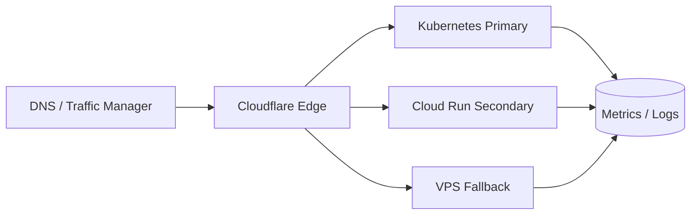

# Hybrid Multi-Cloud

Cocok saat API gateway harus tetap hidup lintas region atau lintas penyedia cloud. Gunakan satu image container yang sama, health check `/ready`, DNS failover, dan secret manager per platform.

Flow ringkas:

