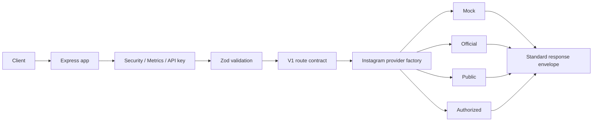

# Architecture

The API uses a clean adapter boundary.



## Source layout

```txt
.
├── src
│   ├── app.js                  # Express composition
│   ├── server.js               # Local/container HTTP runtime
│   ├── config                  # Environment and logger
│   ├── middlewares             # Security, auth, rate limit, errors
│   ├── modules                 # Domain controllers and gateway barrel export
│   ├── providers/instagram     # Provider factory, contract, capabilities, adapters
│   ├── routes                  # System and v1 routers
│   ├── schemas                 # Zod schemas
│   ├── serverless              # Optional serverless adapters
│   ├── services                # Metrics service
│   ├── tests                   # Node test runner coverage
│   └── utils                   # Envelopes, validation helpers, errors, sanitization
├── docs                        # Detailed documentation
├── deploy                      # Optional deployment templates and platform notes
├── public                      # Non-sensitive static status page assets
├── scripts                     # Maintenance scripts
├── netlify/functions           # Netlify preview adapter
└── .github/workflows           # CI
```

`src/schemas/common.schema.js` owns shared primitives, including pagination query validation.

## Runtime and Optional Entry Points

Runtime local and container deployments start from `src/server.js`, which imports `src/app.js`.

Domain controllers live in `src/modules/*.controller.js`. `src/modules/gateway.controller.js` is intentionally a small barrel export so route imports stay stable while controller implementation stays domain-scoped.

Optional platform adapters are intentionally thin wrappers around the same Express app:

- `src/serverless/vercel.js`: Vercel preview adapter used by root `vercel.json`.
- `netlify/functions/api.js`: Netlify function adapter used by root `netlify.toml`.
- `deploy/cloudflare/worker.js`: Cloudflare Worker reverse-proxy template to an existing API origin.

Deployment files under `deploy/*` are templates or platform notes unless a root platform config points to them directly.

## Route Compatibility

Canonical API routes use `/v1`. The `/api/v1` prefix and `/api/v1/instagram/:identifier` are legacy compatibility routes retained for existing clients and covered by tests.
