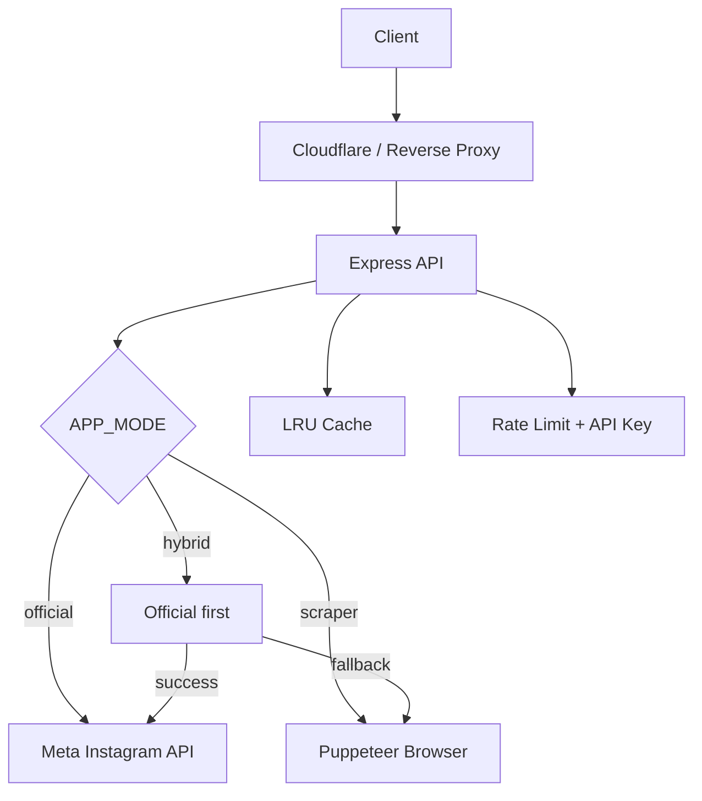

# 🧠 Architecture

## Services

| Service | Tugas |
|---|---|
| `instagram.service.js` | Orchestrator mode official/scraper/hybrid |
| `meta.service.js` | Akses Meta Instagram API resmi |
| `scraper.service.js` | Public scraping best-effort |
| `browser.service.js` | Lifecycle Puppeteer browser |
| `cache.service.js` | Memory cache |
| `queue.service.js` | Concurrency control untuk scraping |

## Why three modes?

- **Official**: paling stabil dan sesuai produksi resmi.
- **Scraper**: fleksibel untuk lokal dan fallback publik.
- **Hybrid**: jalur masa depan; official dulu, fallback scraper jika perlu.
