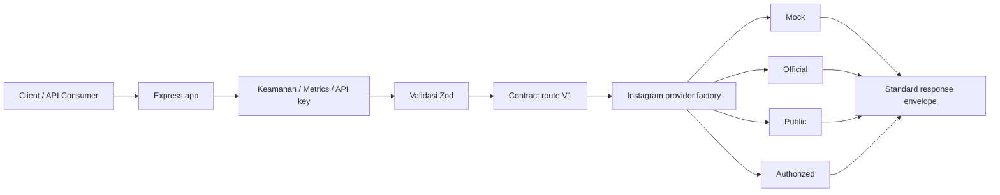
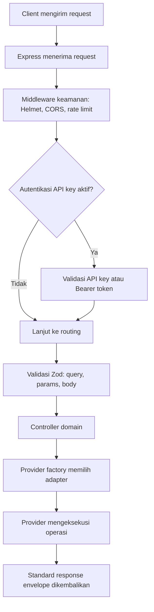

<!-- Dokumen ini menjelaskan arsitektur dan struktur project. -->
<!-- Nama file, folder, dan komponen teknis tetap dalam bahasa Inggris. -->

# Arsitektur

API ini menggunakan batasan adapter yang bersih.

<!-- Diagram alur utama dari client ke provider. -->



## Struktur Source

<!-- Pohon direktori utama project. -->

```txt
.
├── src
│   ├── app.js                  # Komposisi Express
│   ├── server.js               # Runtime HTTP lokal/container
│   ├── config                  # Environment dan logger
│   ├── middlewares             # Keamanan, auth, rate limit, error
│   ├── modules                 # Controller domain dan barrel export gateway
│   ├── providers/instagram     # Provider factory, contract, capabilities, adapter
│   ├── routes                  # Router system dan v1
│   ├── schemas                 # Schema Zod
│   ├── serverless              # Adapter serverless opsional
│   ├── services                # Service metrik
│   ├── tests                   # Cakupan test runner Node
│   └── utils                   # Envelope, helper validasi, error, sanitasi
├── docs                        # Dokumentasi detail
├── deploy                      # Template deployment opsional dan catatan platform
├── public                      # Aset statis halaman status yang tidak sensitif
├── scripts                     # Skrip pemeliharaan
├── netlify/functions           # Adapter preview Netlify
└── .github/workflows           # CI
```

`src/schemas/common.schema.js` mengelola primitif bersama, termasuk validasi query pagination.

## Runtime dan Titik Masuk Opsional

<!-- Penjelasan titik masuk runtime dan adapter opsional. -->

Deployment lokal dan container dimulai dari `src/server.js`, yang mengimpor `src/app.js`.

Controller domain berada di `src/modules/*.controller.js`. `src/modules/gateway.controller.js` sengaja menjadi barrel export kecil agar import route tetap stabil sementara implementasi controller tetap ter-scope domain.

Adapter platform opsional sengaja dibuat sebagai wrapper tipis di sekitar Express app yang sama:

- `src/serverless/vercel.js`: Adapter preview Vercel yang digunakan oleh root `vercel.json`.
- `netlify/functions/api.js`: Adapter fungsi Netlify yang digunakan oleh root `netlify.toml`.
- `deploy/cloudflare/worker.js`: Template reverse-proxy Cloudflare Worker ke origin API yang sudah ada.

File deployment di `deploy/*` adalah template atau catatan platform kecuali konfigurasi platform root langsung merujuk ke sana.

## Kompatibilitas Route

<!-- Penjelasan route kanonis dan alias legacy. -->

Route API kanonis menggunakan `/v1`. Prefix `/api/v1` dan `/api/v1/instagram/:identifier` adalah route kompatibilitas legacy yang dipertahankan untuk klien yang sudah ada dan dicakup oleh test.

## Alur Request

<!-- Diagram alur request dari client ke response. -->



## Pemisahan Layer

<!-- Penjelasan tanggung jawab setiap layer dalam arsitektur. -->

| Layer | Tanggung jawab |
|---|---|
| `app.js` | Komposisi Express: menggabungkan middleware, route, dan error handler. |
| `routes` | Mendefinisikan endpoint system dan route kontrak V1. |
| `middlewares` | Keamanan (Helmet, CORS), autentikasi (API key, Bearer), rate limit, error handler global. |
| `modules` (controller) | Logika domain: memanggil provider, memformat response, menangani error. |
| `schemas` | Validasi input menggunakan Zod: query, params, body request. |
| `providers` | Adapter provider: mock, official, public, authorized. Masing-masing mengimplementasikan contract yang sama. |
| `services` | Service lintas-cutting seperti metrik. |
| `utils` | Envelope response, helper validasi, error class, sanitasi. |

## Provider Factory

<!-- Penjelasan cara provider factory memilih adapter. -->

Provider factory membaca `IG_PROVIDER` dari environment dan membuat instance adapter yang sesuai. Setiap provider mengimplementasikan contract yang sama, tetapi dengan batasan yang berbeda:

- **mock**: Data deterministik lokal; semua operasi tersedia.
- **official**: Menggunakan Meta Graph API resmi; operasi dibatasi oleh scope.
- **public**: Proxy ke upstream yang kamu kontrol; hanya operasi baca.
- **disabled (authorized)**: Dikunci sampai integrasi direview.

## Standard Response Envelope

<!-- Format response standar yang dikembalikan oleh semua endpoint JSON. -->

Semua endpoint JSON mengembalikan envelope standar:

```json
{
  "success": true,
  "data": {},
  "meta": {
    "provider": "mock",
    "requestId": "req_123"
  }
}
```

Error menggunakan envelope yang sama dengan `success: false` dan field `error`:

```json
{
  "success": false,
  "data": null,
  "meta": {
    "provider": "mock",
    "requestId": "req_123"
  },
  "error": {
    "code": "VALIDATION_ERROR",
    "message": "Pesan error",
    "details": {}
  }
}
```

## Error Handling

<!-- Penjelasan mekanisme error handling. -->

Error ditangani di beberapa level:

1. **Validasi Zod**: Schema memvalidasi input sebelum mencapai controller. Error validasi menghasilkan status 400.
2. **Controller**: Error bisnis ditangkap oleh `async-handler` dan dilempar sebagai `AppError`.
3. **Error handler global**: Middleware error terpusat memformat semua error ke standard envelope tanpa membocorkan stack trace ke client.
4. **Provider**: Error provider (credential hilang, upstream down) menghasilkan status yang sesuai (401, 502, 503).

## Test dan Smoke Test

<!-- Penjelasan strategi testing. -->

Project menggunakan test runner bawaan Node.js (`node --test`). Test mencakup:

- **Smoke test API**: Memverifikasi semua endpoint GET dan POST merespons tanpa error route.
- **Contract test**: Memverifikasi provider factory, gateway controller, dan route envelope.
- **Validation test**: Memverifikasi skema Zod termasuk queryBoolean.
- **Security test**: Memverifikasi API key, rate limit, CORS, dan body limit.

Perintah verifikasi:

```bash
npm run verify    # check + lint + test + doctor
npm run smoke:get # smoke test semua endpoint GET
npm run smoke:post # smoke test semua endpoint POST
```

## Catatan Desain

<!-- Prinsip desain yang diterapkan dalam arsitektur. -->

- **Aman**: Tidak ada secret yang ter-embed di kode. Credential diambil dari environment.
- **Modular**: Setiap layer memiliki tanggung jawab tunggal. Provider bisa ditambah tanpa mengubah controller.
- **Mudah dikembangkan**: Contract provider yang konsisten memungkinkan penambahan provider baru tanpa mengubah route atau test existing.
- **Full contract pada mode mock**: Semua endpoint tersedia di mock untuk pengembangan dan testing tanpa credential eksternal.