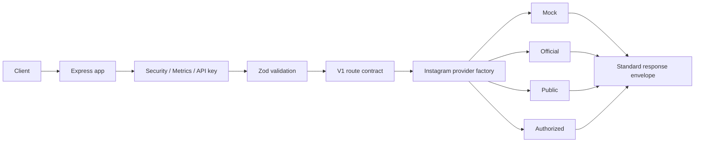

# Architecture

The API uses a clean adapter boundary.

## Source layout

- `src/app.js`: Express app composition.
- `src/server.js`: HTTP server and graceful shutdown.
- `src/config`: environment and logger.
- `src/routes`: system and v1 routers.
- `src/modules/gateway.controller.js`: v1 controller boundary that validates input, calls the selected Instagram provider, and returns the standard response envelope.
- `src/providers/instagram`: provider factory and provider adapters.
- `src/middlewares`: request ID, security, rate limit, API key, errors.
- `src/schemas`: validation schemas.
- `src/utils`: envelope, validation helpers, errors, pagination, Instagram URL parser.
- `src/tests`: Node test runner coverage.
